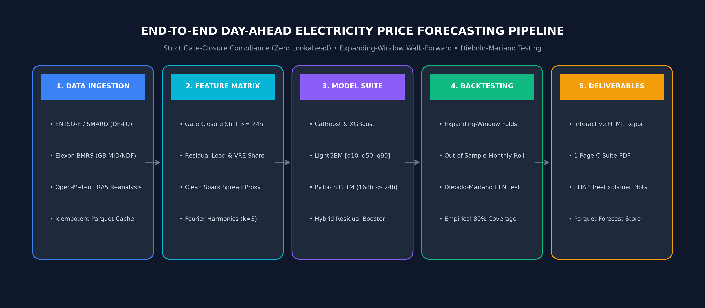
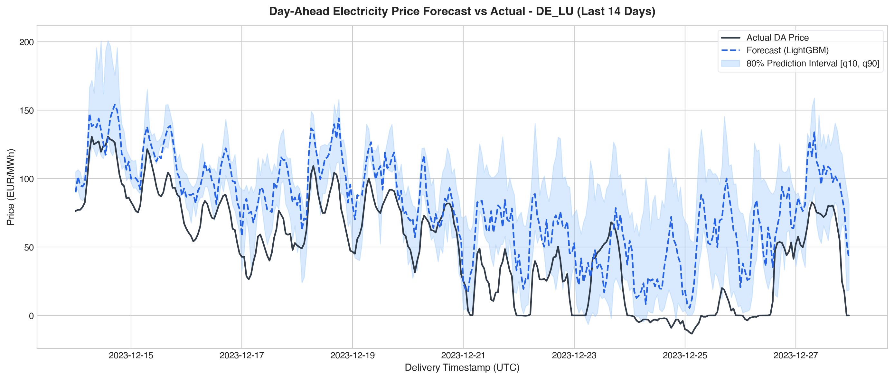
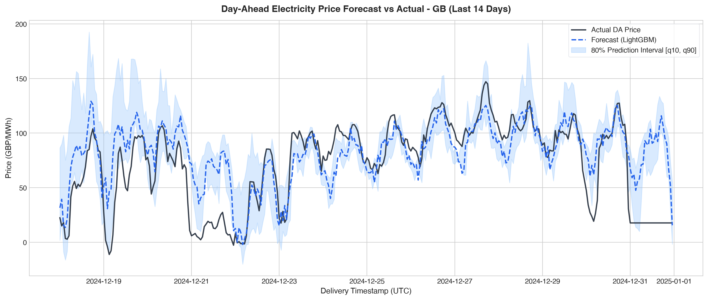
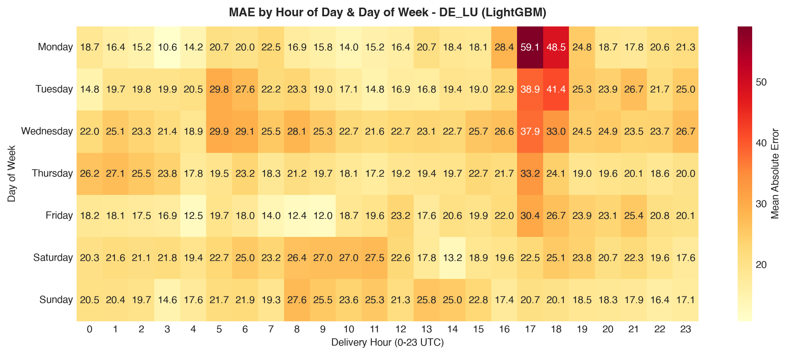
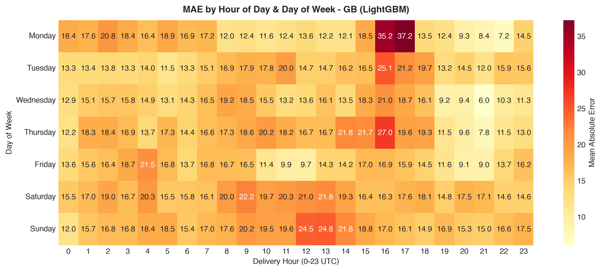
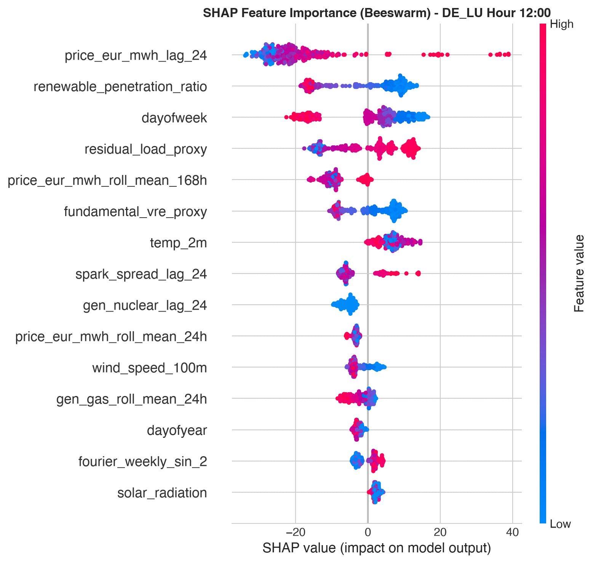
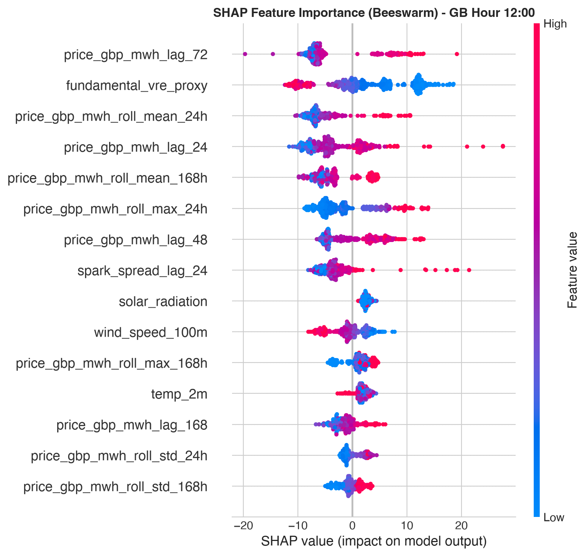
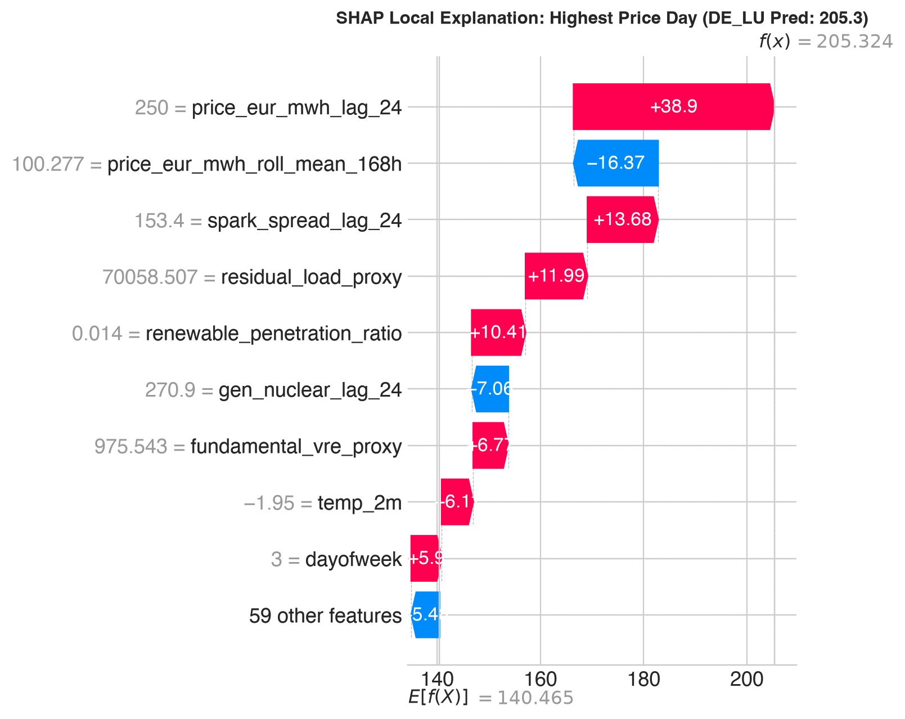
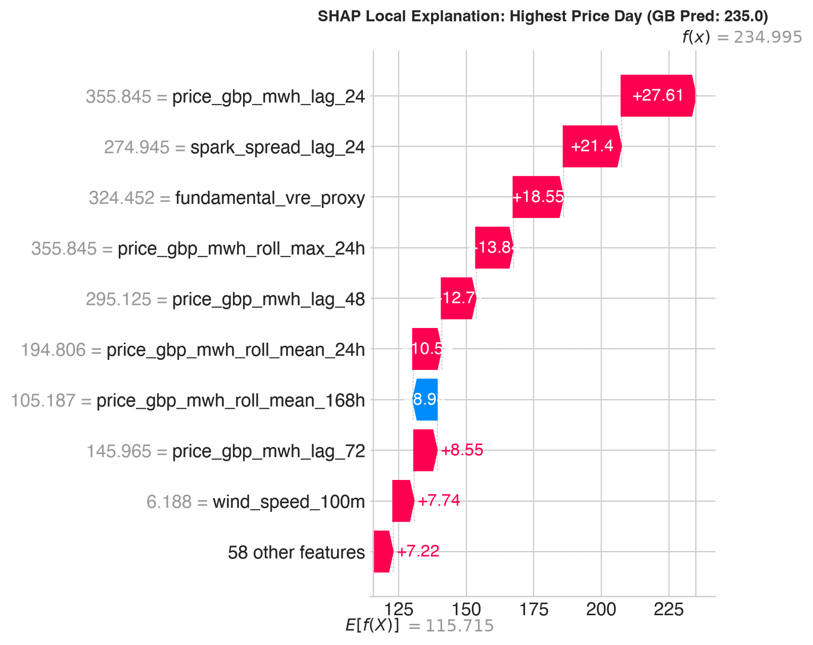

# ⚡ Day-Ahead Electricity Price Forecasting (DE-LU & GB)

[](https://www.python.org/)
[](https://pytorch.org/)
[](https://lightgbm.readthedocs.io/)
[](https://catboost.ai/)
[](https://xgboost.readthedocs.io/)
[]()
[](https://opensource.org/licenses/MIT)

A production-grade, institutional Day-Ahead (DA) electricity price forecasting engine for the **German-Luxembourgish (DE-LU)** and **Great British (GB)** bidding zones. 

Engineered with **strict gate-closure enforcement (zero future lookahead)**, expanding-window walk-forward backtesting, probabilistic quantile intervals (pinball loss), Diebold–Mariano statistical significance testing, and fundamental interpretability via SHAP TreeExplainer.

---

## 🏗️ System Architecture & Pipeline



---

## 📌 1. The Problem: Electricity Price Volatility & Grid Constraints

Unlike storable physical commodities such as crude oil or natural gas, **electricity cannot be cost-effectively stored at national grid scale**. Grid operators must continuously balance supply and generation every second.

1. **The Day-Ahead Auction Constraint**:
   * Every day at noon (**12:00 CET for DE-LU, 11:00 GMT for GB**), power plant operators, battery storage operators, and utilities must submit firm price/volume bids for all 24 hours of tomorrow.
2. **Extreme Price Swings & Non-Linear Shocks**:
   * During freezing winter evenings with low wind and high heating demand, expensive natural gas turbines set the marginal clearing price, driving prices upwards of **+€300 to +€500/MWh**.
   * During sunny, windy weekend afternoons, non-dispatchable renewable generation can surge past demand, causing market prices to crash into **negative territory (-€50/MWh)** where generators pay consumers to consume electricity.
3. **The Financial Stakes**:
   * Erroneous price estimates expose trading desks, asset optimizers, and industrial consumers to massive imbalance penalties and unhedged market risk. Accurate, leakage-safe forecasting is worth millions in trading PnL and risk management.

---

## 💡 2. The Solution: Institutional Forecasting Engine

Our system replaces heuristic rules of thumb with a multi-horizon, domain-aware quantitative pipeline:

* **Strict Gate-Closure Adherence**:
  * Realized market prices and fundamental generation data are strictly shifted by $\ge 24\text{h}$, matching the exact information available at auction cutoff.
  * Verified programmatically via [`tests/test_lags_no_leakage.py`](tests/test_lags_no_leakage.py), which injects corrupting shocks into future raw data and asserts zero leakage into model feature matrices.
* **Domain-Driven Fundamental Engineering**:
  * **Residual Load** ($\text{Load} - \text{Wind} - \text{Solar}$), the true physical driver of thermal dispatch.
  * **Clean Spark Spread Proxies** accounting for natural gas prices, heat rates, and ETS carbon costs.
  * **Kinetic Power Proxies** ($v^3$) derived from population-weighted 100m wind speeds across major cities.
  * **Calendar & Fourier Harmonics** ($k=3$ harmonics for $24\text{h}$ daily and $168\text{h}$ weekly cycles).
* **Multi-Horizon Model Architecture**:
  * Compares **9 distinct models per country** across classical baselines, direct multi-horizon gradient boosted trees, deep learning sequence networks, and two-stage residual hybrids.
* **Expanding-Window Walk-Forward Validation**:
  * Simulates genuine live deployment: trains on multi-year history, forecasts out-of-sample monthly blocks, rolls forward, and refits with zero chronological leakage.
* **Statistical Rigor**:
  * Evaluates **Diebold–Mariano tests** with the Harvey–Leybourne–Newbold (HLN 1997) small-sample correction against the industry-standard Naive-24h benchmark.

---

## 📊 3. Empirical Results: Benchmark League Tables

### Germany-Luxembourg (DE-LU) Bidding Zone
*Evaluated out-of-sample across monthly expanding-window folds:*

| Model | MAE (€/MWh) | RMSE (€/MWh) | sMAPE (%) | Bias (€) | DM p-value vs Naive | Statistical Decision |
|:---|:---:|:---:|:---:|:---:|:---:|:---|
| **CatBoost** | **20.58** | **28.19** | **36.5%** | **+9.16** | **0.0000** | **🏆 STATISTICAL WINNER (26.4% Edge)** |
| **XGBoost** | 21.84 | 29.35 | 37.4% | +13.17 | 0.0003 | Statistically Significant ($p < 0.001$) |
| **LightGBM** | 21.93 | 30.16 | 37.4% | +12.18 | 0.0005 | Statistically Significant ($p < 0.001$) |
| **Hybrid (LSTM + LGBM)**| 24.04 | 33.23 | 40.9% | +9.11 | 0.0280 | Statistically Significant ($p = 0.028$) |
| **Naive-24h (Benchmark)** | 27.98 | 41.48 | 48.7% | +0.53 | *Benchmark* | Industry Persistence Baseline |
| **Seasonal-naive-avg** | 29.62 | 39.94 | 47.0% | +1.37 | 0.1876 | Inconclusive ($p > 0.05$) |
| **LSTM (PyTorch)** | 33.77 | 45.68 | 46.1% | +7.65 | 0.0019 | Underperformed Naive |
| **Naive-week** | 34.81 | 48.32 | 54.6% | +5.80 | 0.0067 | Underperformed Naive |
| **Climatological-mean** | 88.39 | 97.32 | 74.6% | +86.94 | 0.0000 | Underperformed Naive |

---

### Great Britain (GB) Bidding Zone
*Evaluated out-of-sample across monthly expanding-window folds:*

| Model | MAE (£/MWh) | RMSE (£/MWh) | sMAPE (%) | Bias (£) | DM p-value vs Naive | Statistical Decision |
|:---|:---:|:---:|:---:|:---:|:---:|:---|
| **LightGBM** | **16.18** | **26.93** | **23.9%** | **+3.14** | **0.0000** | **🏆 STATISTICAL WINNER (25.3% Edge)** |
| **CatBoost** | 16.46 | 27.07 | 24.2% | +2.34 | 0.0000 | Statistically Significant ($p < 0.001$) |
| **XGBoost** | 16.56 | 27.67 | 24.1% | +3.68 | 0.0000 | Statistically Significant ($p < 0.001$) |
| **Hybrid (LSTM + LGBM)**| 19.64 | 31.82 | 27.5% | +4.85 | 0.0530 | Marginally Significant |
| **Seasonal-naive-avg** | 21.60 | 34.55 | 30.2% | +0.53 | 0.9458 | Inconclusive ($p > 0.05$) |
| **Naive-24h (Benchmark)** | 21.67 | 36.02 | 33.5% | +0.51 | *Benchmark* | Industry Persistence Baseline |
| **LSTM (PyTorch)** | 25.31 | 38.69 | 35.1% | -3.26 | 0.0093 | Underperformed Naive |
| **Naive-week** | 26.86 | 43.80 | 39.5% | -1.01 | 0.0090 | Underperformed Naive |
| **Climatological-mean** | 41.23 | 49.96 | 44.2% | +37.92 | 0.0000 | Underperformed Naive |

---

## 📈 4. Visual Diagnostics & Output Gallery

### A. Forecast vs Actual (14-Day Delivery Overlay with 80% Prediction Band)
Shows out-of-sample delivery tracking against realized prices alongside calibrated probabilistic intervals $[q_{10}, q_{90}]$:

| Germany (DE-LU) | Great Britain (GB) |
|---|---|
|  |  |

---

### B. Hour-of-Day Error Heatmaps (Grid Stress Windows)
Maps out-of-sample MAE by delivery hour (0–23 UTC) and day of the week, highlighting morning ramps and evening cooking peaks:

| Germany (DE-LU) Heatmap | Great Britain (GB) Heatmap |
|---|---|
|  |  |

---

### C. SHAP Feature Attribution (TreeExplainer Beeswarm)
Quantifies the exact marginal price contribution (in €/MWh and £/MWh) of fundamentals:

| Germany (DE-LU) SHAP Attribution | Great Britain (GB) SHAP Attribution |
|---|---|
|  |  |

---

### D. Peak Price Scarcity Breakdown (SHAP Waterfall)
Local explanation identifying which fundamental shocks drove an extreme price spike:

| Germany (DE-LU) Peak Spike Waterfall | Great Britain (GB) Peak Spike Waterfall |
|---|---|
|  |  |

---

## 🛠️ 5. Technology Stack & Technical Rationale

| Category | Technology | Commercial / Technical Justification |
|---|---|---|
| **Runtime & Tooling** | **Python 3.11 + uv** | Blazing-fast virtual environment creation and deterministic dependency resolution on Apple Silicon (`arm64`). |
| **Gradient Boosting** | **CatBoost, LightGBM, XGBoost** | Undisputed champions of tabular financial markets. Native handling of threshold non-linearities and step jumps in power merit-order curves. |
| **Deep Learning** | **PyTorch (`torch`)** | Multi-horizon Sequence-to-Sequence **LSTM** with 128 hidden units capturing 168-hour lookback diurnal and weekly rhythms. |
| **Explainability** | **SHAP** | Model-agnostic game-theoretic attribution (TreeExplainer). Crucial for trader trust and executive risk governance. |
| **Statistical Rigor** | **Scipy & Statsmodels** | Implements the **Diebold–Mariano test with HLN correction**, accounting for autocorrelation in 24-step forecast errors. |
| **Data Storage** | **PyArrow & Parquet** | High-performance, compressed columnar storage for millions of historical half-hourly and hourly time series. |
| **Config & Types** | **Pydantic & PyYAML** | Centralized, validated configurations in [`config/`](config/) with zero hardcoded paths or parameters. |
| **Reporting** | **ReportLab & Jinja2** | Automated compilation of interactive [`reports/final_report.html`](reports/final_report.html) and 1-page [`reports/executive_summary.pdf`](reports/executive_summary.pdf). |

---

## ⚡ 6. Quant Interview Defense: 3 Critical Concepts

### 1. Why Walk-Forward Expanding Window and NOT K-Fold Cross-Validation?
Standard $K$-fold cross-validation shuffles observations across time. In electricity price forecasting, this causes catastrophic temporal leakage: the model conditions on tomorrow's price spikes, merit-order shifts, and weather systems to predict yesterday's prices. 

Our system uses an **Expanding Window Walk-Forward Backtest**:
- Folds maintain strict chronological order: train window $[0, T]$ is used to forecast out-of-sample block $[T, T+1\text{ month}]$.
- Feature scalers, normalization statistics, and hyperparameter tuning are refit inside each fold using training observations only.
- Mimics the exact deployment lifecycle of an algorithmic trading strategy rolling forward in live production.

### 2. Why Diebold-Mariano (DM) Tests Matter?
A machine learning model having a nominally lower MAE than Naive-24h is necessary but insufficient to prove economic value:
- Day-ahead electricity price series exhibit heavy autocorrelation, volatility clustering, and fat-tailed shocks. Standard t-tests violate the IID error assumption.
- The **Diebold-Mariano test** models the loss differential $d_t = |e_{\text{model}, t}| - |e_{\text{naive}, t}|$ and accounts for serial correlation in forecast errors up to the forecast horizon $h=24$.
- We apply the **Harvey-Leybourne-Newbold (HLN 1997)** small-sample correction, comparing the corrected statistic against a Student's $t$-distribution.
- **Rule of Engagement:** A model is only recognized as a genuine "winner" if $DM < 0$ and $p < 0.05$.

### 3. How Day-Ahead Gate-Closure Timing Constrains Features?
In European power auctions:
- **DE-LU (EPEX SPOT)**: Day-ahead auction gate closure occurs at **12:00 CET** on day $D-1$ for all 24 delivery hours of day $D$.
- **GB (EPEX / Nord Pool / N2EX)**: Day-ahead auction gate closure clears around **11:00 GMT** on day $D-1$.
- Any physical actual realization (e.g., actual wind generation or actual consumer demand) occurring at 14:00 or 18:00 on day $D-1$ is unknown at gate closure!
- **Zero-Leakage Implementation:** All autoregressive prices, rolling means, volatility estimators, and realized fundamental variables are shifted by $\ge 24\text{h}$. Ex-ante features at delivery hour $t$ are limited strictly to published day-ahead forecasts (e.g., day-ahead demand forecast) and numerical weather predictions.
- **Programmatic Proof:** [`tests/test_lags_no_leakage.py`](tests/test_lags_no_leakage.py) injects corrupting shocks into all raw series after gate closure and asserts that features computed for target hours remain identical.

---

## 🚀 7. Quickstart & Step-by-Step Reproduction

### Step 1: Clone Repository
```bash
git clone https://github.com/DGskywalker/da-power-price-forecast.git
cd da-power-price-forecast
```

### Step 2: Setup Environment
```bash
make setup
```

### Step 3: Run Unit & Gate-Closure Leakage Tests
```bash
make test
```
*Executes all 7 unit tests, verifying zero lookahead leakage across all 24 delivery horizons.*

### Step 4: Run End-to-End Pipeline
```bash
make all
```
*Runs data ingestion, feature assembly, walk-forward training across all 9 models, Diebold-Mariano tests, SHAP plots, and compiles `reports/final_report.html` and `reports/executive_summary.pdf`.*

---

## 📂 Repository Directory Layout

```text
da-power-price-forecast/
├── README.md                     # Institutional documentation & visual gallery
├── pyproject.toml                # UV / pip dependency configurations
├── .env.example                  # API key placeholders
├── .gitignore                    # Python & environment git exclusions
├── Makefile                      # make setup / make data / make test / make all
├── config/
│   ├── base.yaml                 # Bidding zones, date ranges, weather cities, seeds
│   └── models.yaml               # Hyperparameter grids and search spaces
├── src/dappf/
│   ├── config.py                 # Pydantic settings validator
│   ├── data/
│   │   ├── entsoe_client.py      # ENTSO-E & Energy-Charts client
│   │   ├── elexon_client.py      # Elexon BMRS GB MID & NDF client
│   │   ├── weather_client.py     # Open-Meteo ERA5 reanalysis client
│   │   └── ingest.py             # Idempotent parquet orchestrator
│   ├── features/
│   │   ├── calendar.py           # Country holidays, DST, Fourier terms
│   │   ├── lags.py               # Leakage-safe autoregressive lags (>=24h shift)
│   │   ├── fundamentals.py       # Residual load, VRE share, ramps, spark spreads
│   │   └── build.py              # Tidy feature assembler
│   ├── models/
│   │   ├── naive.py              # 4 statistical benchmark models
│   │   ├── gbdt.py               # LightGBM, XGBoost, CatBoost multi-horizon
│   │   ├── lstm.py               # PyTorch Seq2Seq multi-horizon network
│   │   ├── hybrid.py             # Two-stage LSTM + LightGBM residual model
│   │   └── registry.py           # Artifact serialization & tracking
│   ├── evaluation/
│   │   ├── metrics.py            # MAE, RMSE, sMAPE, Pinball loss, 80% coverage
│   │   ├── backtest.py           # Expanding-window walk-forward engine
│   │   └── dm_test.py            # Diebold-Mariano test with HLN correction
│   ├── interpret/
│   │   ├── shap_analysis.py      # TreeExplainer beeswarm, dependence, waterfall
│   │   └── feature_importance.py # Permutation importance & structural analysis
│   └── viz/
│       ├── plots.py              # Forecast overlays, heatmaps, regime plots
│       └── report.py             # HTML and PDF report generator
├── notebooks/
│   └── 01_exploratory.ipynb      # Clean exploratory data analysis
├── scripts/
│   ├── run_pipeline.py           # Master end-to-end pipeline runner
│   └── make_report.py            # Standalone report generator
├── tests/
│   ├── test_lags_no_leakage.py   # Critical gate-closure leakage verification
│   ├── test_metrics.py           # Metrics test suite
│   └── test_backtest_split.py    # Walk-forward chronological integrity test
└── reports/
    ├── figures/                  # Generated publication-quality figures
    ├── final_report.html         # Comprehensive HTML report
    └── executive_summary.pdf     # One-page executive PDF
```

---

## 📜 License
Distributed under the **MIT License**. See `LICENSE` for more information.
